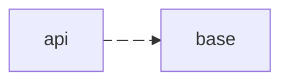

# 📚 Guia Técnico Interno – Boas Práticas em Java/Spring

## Objetivo  
Este guia apresenta práticas recomendadas para desenvolvimento em **Java/Spring** no time de T.I.  
O objetivo é garantir **código mais limpo, testável e sustentável**, reduzindo problemas de manutenção a longo prazo.

---

## 1️⃣ Documentação técnica das APIs no `README.md`

Toda API **deve conter documentação técnica atualizada no `README.md`** do repositório.  
O objetivo é **facilitar o entendimento da aplicação**, acelerar onboarding de novos membros, aumentar a qualidade das entregas e garantir rastreabilidade das mudanças.

### Benefícios  
- **Transparência**: todos têm acesso rápido ao funcionamento da API.  
- **Onboarding mais ágil**: novos desenvolvedores entendem rapidamente o contexto do projeto.  
- **Facilita testes e troubleshooting**: informações centralizadas evitam perda de tempo.  
- **Inclusão**: textos claros e estruturados auxiliam pessoas com deficiência visual que utilizam leitores de tela.  

### Estrutura recomendada  
| Seção | Conteúdo esperado |
|-------|-------------------|
| **📖 Contexto** | Descreva o propósito da API, público-alvo e papel dentro do ecossistema. |
| **🔗 Dependências de Infra** | Liste Bancos, filas, tópicos Kafka, secrets ou outros serviços consumidos. |
| **📦 Payloads de entrada e saída** | Exponha exemplos de requisições e respostas em JSON ou outros formatos. |
| **🚀 Como subir localmente** | Explique passo a passo como rodar a API em ambiente local (Docker, variáveis de ambiente, comandos Maven/Gradle). |
| **🧩 Endpoints principais** | Liste endpoints com métodos HTTP, parâmetros e breve descrição. |
| **🔐 Segurança** | Descreva autenticação, autorização, tokens, certificados etc. |
| **⚠️ Limitações conhecidas** | Cite restrições de uso, quotas ou pontos críticos. |
| **📊 Fluxograma / Mermaid** | Representação visual dos principais fluxos ou interações da API usando [Mermaid](https://mermaid.js.org/) ou fluxograma equivalente. |

### Exemplo de payload (entrada)
```json
POST /pagamentos
{
  "idCliente": "12345",
  "valor": 100.50,
  "formaPagamento": "boleto"
}
```

### Exemplo de fluxograma obrigatório



## 1️⃣ Por que não utilizar `@Autowired` diretamente no Spring  

O uso de `@Autowired` (principalmente em atributos) é desencorajado.  
Prefira **injeção por construtor**, uma abordagem mais moderna e segura.

### Motivos
- **Imutabilidade**: dependências são finais e não podem ser alteradas após a construção.  
- **Facilidade de teste**: facilita o uso de mocks sem precisar de contexto Spring.  
- **Clareza**: dependências explícitas no construtor.  
- **Ciclo de vida previsível**: reduz problemas de inicialização tardia.  
- **Padrão moderno**: a partir do Spring 4.3, se houver apenas um construtor, o `@Autowired` não é necessário.  

### Boas práticas
```java
@Component
public class PaymentService {

    private final PaymentRepository repository;

    // Injeta via construtor (melhor prática)
    public PaymentService(PaymentRepository repository) {
        this.repository = repository;
    }
}
```

### Referências
- [Spring Documentation – Dependency Injection](https://docs.spring.io/spring-framework/docs/current/reference/html/core.html#beans-constructor-injection)
- [Why Field Injection is Evil (StackOverflow)](https://stackoverflow.com/questions/39890849/what-exactly-is-field-injection-and-how-to-avoid-it)
- [Baeldung – Constructor Injection in Spring](https://www.baeldung.com/spring-dependency-injection#constructor-injection)

## 2️⃣ Por que não utilizar Lombok  

Lombok é uma biblioteca popular para reduzir boilerplate, mas traz pontos negativos significativos para manutenção e evolução do código.  
A decisão de **não utilizar Lombok** visa manter o projeto mais **simples, sustentável e inclusivo** para todos os membros do time.

### Pontos negativos do uso do Lombok  
- **Acoplamento**: adiciona dependência extra que pode dificultar atualizações do Java e do Spring.  
- **Problemas de compilação**: gera código na fase de compilação, podendo causar incompatibilidades e dificultar debugging.  
- **Legibilidade**: oculta o código gerado, tornando difícil entender o comportamento real para novos membros do time.  
- **Experimental**: lombok tem muitas features experimentais misturadas com as estaveis, correndo o risco de implementar algo nao confiavel em produção.

### Alternativas modernas ao Lombok  
- **Java Records (Java 14+)** para DTOs:  
```java
  public class Customer {
    private final String name;
    private final String email;

    public Customer(String name, String email) {
        this.name = name;
        this.email = email;
    }

    public String getName() { return name; }
    public String getEmail() { return email; }
  }
```

## 6️⃣ Versões Utilizadas  

Para manter consistência, compatibilidade e suporte técnico, todos os projetos do time devem especificar **as versões obrigatórias das tecnologias principais**.

### Tecnologias principais
| Tecnologia | Versão obrigatória | Observações |
|------------|-----------------|------------|
| **Java** | 21 | Utilizar o JDK 21, garantindo suporte às features modernas do Java, como records, pattern matching e melhorias de performance. |
| **Spring Boot** | 3.x | Garantir compatibilidade com Java 21 e uso das novas APIs do Spring 3, incluindo Spring Web, Spring Data e segurança. |

## 3️⃣ Escrever código em português (PT-BR)  

Para melhorar **clareza, inclusão e acessibilidade**, o código-fonte, comentários e nomes de variáveis/métodos devem ser escritos em **português claro**.

### Benefícios
- **Inclusão e acessibilidade**: pessoas com deficiência visual ou que utilizam leitores de tela conseguem entender melhor o código.  
- **Clareza para o time**: facilita comunicação, pair programming e onboarding de novos membros.  
- **Manutenção simplificada**: reduz ambiguidades e aumenta a legibilidade do código.  
- **Facilita documentação**: comentários e README.md ficam consistentes e compreensíveis.

### Boas práticas
- Nomes de **variáveis, métodos e classes** devem ser descritivos em português.
- Comentários devem **explicar o propósito do código**, não apenas repetir o que ele faz.
- Evitar abreviações ou termos técnicos obscuros que possam dificultar o entendimento.
- Usar padrões consistentes no time, por exemplo: `calcularJurosSimples()` ao invés de `calcJuros()`.  

### Exemplo de código em português
```java
// Calculadora de juros simples
public class CalculadoraDeJuros {

    /**
     * Calcula o valor de juros simples com base no capital, taxa e tempo.
     *
     * @param capital Valor inicial sobre o qual os juros serão calculados
     * @param taxa Taxa de juros em percentual
     * @param tempo Tempo em meses
     * @return Valor dos juros simples
     */
    public double calcularJurosSimples(double capital, double taxa, int tempo) {
        return capital * (taxa / 100) * tempo;
    }
}
```

> [!TIP]
> - Mantenha consistência entre todos os projetos do time.
> - Prefira português nos nomes de classes, métodos e pacotes relacionados ao negócio.
> - Comentários devem ser curtos, claros e informativos, evitando redundância.
> - Se houver integração com sistemas externos, manter clareza ao mapear termos do domínio de negócio.

## 7️⃣ Evitar o overhead de interfaces nas aplicacoes

Embora o uso de interfaces seja uma prática comum em projetos Java, **não é necessário criar interfaces para todas as classes**, especialmente em aplicações **simples ou de baixa complexidade**.  

### Motivação
- **Simplicidade**: projetos simples ficam mais fáceis de entender e manter sem abstrações desnecessárias.  
- **Menor complexidade**: evita acoplamento excessivo e excesso de classes/métodos.  
- **Agilidade**: desenvolvimento mais rápido e direto, sem sacrificar qualidade.  
- **Foco no negócio**: permite que o time concentre esforços nas regras de negócio, não em padrões arquiteturais que não agregam valor.  

### Quando criar uma interface
- Se houver **mais de uma implementação** prevista (ex.: repositório em memória e em banco).  
- Se for necessário **mock para testes unitários** complexos.  
- Quando a aplicação tende a **escalar em complexidade** no futuro.  

### Exemplo de abordagem simples (sem interface desnecessária)
```java
// Classe concreta suficiente para casos simples
public class CalculadoraDeJuros {

    public double calcularJurosSimples(double capital, double taxa, int tempo) {
        return capital * (taxa / 100) * tempo;
    }
}
```

### Exemplo quando usar interface

```java
public interface RepositorioPagamento {
    void salvar(Pagamento pagamento);
}

public class RepositorioPagamentoBasePersistente implements RepositorioPagamento {
    @Override
    public void salvar(Pagamento pagamento) {
        // lógica de persistência na base fisica
    }
}

public class RepositorioPagamentoMemoria implements RepositorioPagamento {
    @Override
    public void salvar(Pagamento pagamento) {
        // lógica de persistência em memória (teste ou protótipo)
    }
}
```

> [!TIP]
> - Avaliar o tamanho e complexidade do projeto antes de criar interfaces.
> - Priorizar soluções diretas e simples quando não houver necessidade de múltiplas implementações.
> - Revisar interfaces periodicamente para evitar abstrações que não agregam valor real.

## 8️⃣ Arquitetura Hexagonal (Ports & Adapters)  

O padrão **Hexagonal Architecture** (ou Ports & Adapters) organiza sistemas de forma **modular, testável e flexível**, separando a **lógica de negócio** das **dependências externas** (bancos, filas, APIs externas).  

### Benefícios
- **Isolamento da lógica de negócio**: regras de negócio ficam independentes de frameworks, bancos ou APIs externas.  
- **Facilidade de testes**: é simples testar o domínio sem depender de infraestrutura.  
- **Flexibilidade para mudanças**: trocar implementações externas sem alterar o core do sistema.  
- **Padronização do time**: facilita manutenção e onboarding.  

### Usar interfaces **somente quando necessário**
- Crie **Ports (interfaces)** apenas quando houver:  
  - Mais de uma implementação prevista (ex.: repositório em memória e em banco).  
  - Necessidade de mock para testes unitários complexos.  
  - Potencial de crescimento em complexidade futura.  
- Em **aplicações simples ou protótipos**, prefira **classes concretas diretas**, mantendo o sistema mais simples e prático.  

### Estrutura típica

         +-------------------+
         |   Aplicação / UI   |
         +-------------------+
                 |
         +-------------------+
         | Adapters / Driver |
         |  (Controllers,    |
         |   REST, Kafka)    |
         +-------------------+
                 |
         +-------------------+
         |     Ports/API     |
         |  (Interfaces – apenas quando necessário) |
         +-------------------+
                 |
         +-------------------+
         |  Core / Domain    |
         |  (Regras de Negócio) |
         +-------------------+
                 |
         +-------------------+
         | Adapters / Driven |
         | (Banco, S3, etc.)|
         +-------------------+


### Exemplo de implementação

```java
// Port – criar apenas se houver necessidade de múltiplas implementações
public interface RepositorioPagamento {
    void salvar(Pagamento pagamento);
}

// Adapter – implementação concreta
public class RepositorioPagamentoDynamoDB implements RepositorioPagamento {
    @Override
    public void salvar(Pagamento pagamento) {
        // lógica para salvar no DynamoDB
    }
}

// Core / Domain
public class ServicoPagamento {
    private final RepositorioPagamento repositorio;

    public ServicoPagamento(RepositorioPagamento repositorio) {
        this.repositorio = repositorio;
    }

    public void processar(Pagamento pagamento) {
        // regras de negócio
        repositorio.salvar(pagamento);
    }
}

// Em casos simples, classe concreta pode ser usada direto sem interface
public class ServicoPagamentoSimples {
    public void processar(Pagamento pagamento) {
        // lógica simples sem abstração
        System.out.println("Pagamento processado: " + pagamento.getId());
    }
}
```

> [!TIP]
> - Evitar interfaces desnecessárias em projetos simples.
> - Criar Ports apenas quando houver necessidade real de abstração ou testes complexos.
> - Separar claramente domain, adapters e ports.
> - Manter testes unitários do core independentes de infraestrutura.

## 9️⃣ Padronização de Commits  

Para manter histórico **claro, consistente e rastreável**, todos os commits devem seguir um padrão definido pelo time.  
Isso facilita **revisão de código, debugging e entendimento das mudanças**.

### Benefícios
- **Histórico legível**: todos entendem rapidamente o que cada commit faz.  
- **Facilita code review**: padrões consistentes ajudam revisores a identificar mudanças relevantes.  
- **Integração com ferramentas**: mensagens padronizadas podem ser usadas em changelogs automáticos ou CI/CD.  
- **Inclusão**: mensagens claras auxiliam membros que utilizam leitores de tela ou tradução automática.  

### Regras recomendadas
- **Formato sugerido (Conventional Commits)**:  

<*tipo*>: <*descrição curta*>

[descrição detalhada opcional]

[referência a issue ou ticket opcional]

- **Tipos comuns de commit**:

| Tipo      | Uso                                              |
|-----------|--------------------------------------------------|
| `feat`    | Nova funcionalidade                              |
| `fix`     | Correção de bug                                  |
| `docs`    | Alterações na documentação                       |
| `refactor`| Refatoração de código sem mudança de comportamento|
| `test`    | Adição ou correção de testes                     |
| `chore`   | Tarefas de manutenção (build, scripts, configs)  |

### Exemplos de commits

feat: adicionar validação de CPF
fix: corrigir cálculo de juros simples
docs: atualizar exemplos de payload
refactor: simplificar método de processamento
